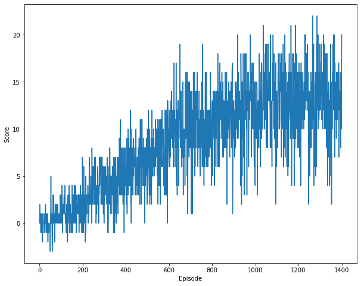

# Report

This is a brief summary about the implementation chosen to solve the problem.

### Learning Algorithm

Deep Q-Network ([paper](https://storage.googleapis.com/deepmind-media/dqn/DQNNaturePaper.pdf)), 
with Double DQN extention ([paper](https://arxiv.org/abs/1509.06461)) was used to solve the problem.

The network architecture itself is quite simple and consists of an input, 2 hidden and output linear layers, all followed ```ReLU```
activation function, with the exception for the last one:

```python
self.model = nn.Sequential(
   nn.Linear(state_size, 128),
   nn.ReLU(),
   nn.Linear(128, 256),
   nn.ReLU(),
   nn.Linear(256, 128),
   nn.ReLU(),
   nn.Linear(128, action_size)
)
```

Hyperparameters used in the algorithm are as follows:

- ```capacity = 1e5``` - Amount of experiences that can be stored in the memory buffer
- ```batch_size = 32``` - Size of each minibatch that are used for training the network to learn optimal action given state. Those are sampled from memory buffer.
- ```lr = 1e-4``` - Learning rate at which the model learns
- ```gamma = 0.99``` - Discount factor which specifies how important (or not) are the past rewards
- ```tau = 1e-3``` - Used when updating the target network with parameters from local network, so that they are not equally the same
- ```learn_every_n_steps = 4``` - Agent will only learn after taking this many actions.
- ```epsilon_decay = 0.998``` - Controls how epsilon used in e-greedy policy changes every episode
- ```min_epsilon = 0.1``` - The smallest value epsilon used in e-greedy policy can reach.

### Plot of Rewards

The following plots shows rewards collected by the agent over time (episodes)



```python
Episode 100/2000. | Average Score: 0.31.
Episode 200/2000. | Average Score: 1.34.
Episode 300/2000. | Average Score: 3.26.
Episode 400/2000. | Average Score: 4.48.
Episode 500/2000. | Average Score: 6.12.
Episode 600/2000. | Average Score: 7.48.
Episode 700/2000. | Average Score: 10.06.
Episode 800/2000. | Average Score: 9.95.
Episode 900/2000. | Average Score: 11.28.
Episode 1000/2000. | Average Score: 12.0.
Episode 1100/2000. | Average Score: 12.42.
Episode 1200/2000. | Average Score: 12.79.
Episode 1300/2000. | Average Score: 12.82.
Episode 1400/2000. | Average Score: 13.22.
```

### Ideas for Future Work

- Prioritized Experience Replay
- Dueling DQN
- RAINBOW
- Try training model on pixel values
