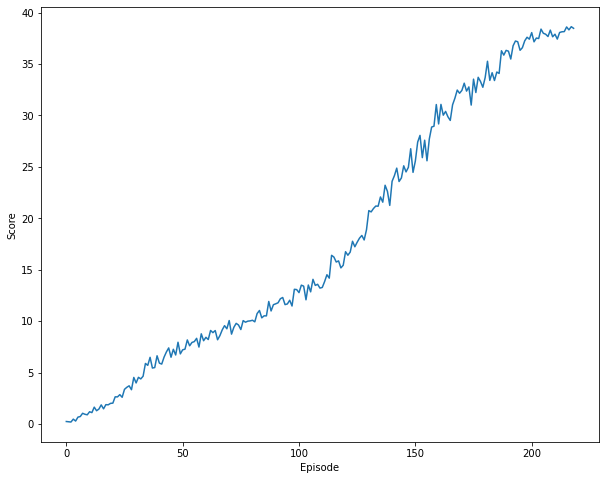

# Report

This is a brief summary about the implementation chosen to solve the problem.

### Learning Algorithm

Proximal Policy Optimization (PPO) algorithm ([paper](https://arxiv.org/abs/1707.06347)) was used to solve the problem.
Generalized Advantage Estimation was used to calculate estimated returns. ([paper](https://arxiv.org/abs/1506.02438))

The network architecture consists of branched Actor and Critic models, that share the same base built out of 2 linear network 
each followed by relu activation function. The critic learns what is the estimated reward for each step, while actor learn
what step to take given the environment state.

```python
self.base = nn.Sequential(
   linear_block(state_size, hidden_size),
   linear_block(hidden_size, hidden_size)
)

self.actor_lin = nn.Linear(hidden_size, action_size)
self.critic_lin = nn.Linear(hidden_size, 1)
```

Hyperparameters used in the algorithm are as follows:

- ```batch_size = 64``` - Size of each minibatch that are used for training the network to learn.
- ```lr = 1e-4``` - Learning rate at which the model learns.
- ```gamma = 0.99``` - Discount factor which specifies how important (or not) are the past rewards
- ```gae_tau = 0.95``` - Used to weight each of the n-bootstrapped estimated returns. Part of GAE.
- ```beta = 0.001``` - Control how much noise (entropy) to add to the actor's loss, which encourages exploration.
- ```epsilon_clip = 0.2``` - Clips the ratio between the ratio of logprobs from new policy and old policy, so that the network doesn't change the old polict too much
- ```gradient_clip = 10``` - Clips the calculated gradient at each step.

### Plot of Rewards

The following plots shows rewards collected by the agent over time (episodes). The environment was solved in 218 episodes.



```python
Episode 0/500 | Average Score: 0.24
Episode 50/500 | Average Score: 3.54
Episode 100/500 | Average Score: 6.78
Episode 150/500 | Average Score: 14.31
Episode 200/500 | Average Score: 25.71
Environment solved in 218!
```

### Ideas for Future Work

Try any of the following algorithms:

- A2C (Advantage Actor Critic)
- A3C (Asynchronous Advantage Actor-Critic)
- DDPG (Deep Deterministic Policy Gradients)
- D4PG (Distributed Distributional Deterministic Policy Gradients)

Or play with hyperparmeters and network architecture to see if it is possible to speed up training process and achieve better convergance.
