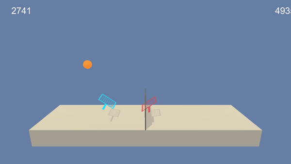

# Unity Tennis 

Project 3 from Udacity cource on Deep Reinforcement Learning.

### Aim

In this environment, two agents control rackets to bounce a ball over a net. 
If an agent hits the ball over the net, it receives a reward of +0.1. 
If an agent lets a ball hit the ground or hits the ball out of bounds, it receives a reward of -0.01. 
Thus, the goal of each agent is to keep the ball in play.



### Environment

The observation space consists of 8 variables corresponding to the position and velocity of the ball and racket. 
Each agent receives its own, local observation. 
Two continuous actions are available, corresponding to movement toward (or away from) the net, and jumping.

The task is episodic, and in order to solve the environment, your agents must get an average score of +0.5 (over 100 consecutive episodes, after taking the maximum over both agents):

- After each episode, we add up the rewards that each agent received (without discounting), to get a score for each agent. This yields 2 (potentially different) scores. We then take the maximum of these 2 scores.
- This yields a single score for each episode.

The environment is considered solved, when the average (over 100 episodes) of those scores is at least +0.5.

### Getting Started

Ensure ```Python 3.6``` and ```PyTorch 1.5``` along with ```UnityML-Agents``` and ```OpenAI Gym``` are installed in your environment. 
What is also required is the Banana.exe application built in Unity - please refer to Udacity course for more details.

### Instructions

There are 2 python scripts and 1 Jupyter Notebook in this project. Jupyter notebook contains all the code necessary to train and
test the agent, while the python scripts are divided based by their functions:

- ```ActorCritic.py``` - Torch module holding Actor-Critic model that helps agent pick the most optimal action given environment state
- ```Agent.py``` - Proximal Policy Optimization agent, deals with choosing appropriate action given state, processes environment reaction and stores trajectories
- ```MultiAgent.py``` - Main class that wraps multiple ```Agent``` and learns a single ```ActorCritic``` model based on collected, shared experiences across all agents.

### Implementation

Implementation is described in ```Report.md```

This is an adoptation of my PPO implementation I did for project 2 ([link](https://github.com/8horn/udacity-deep-reinforcement-learning/tree/master/project-2-continuous-control)) for multi agent environment.
