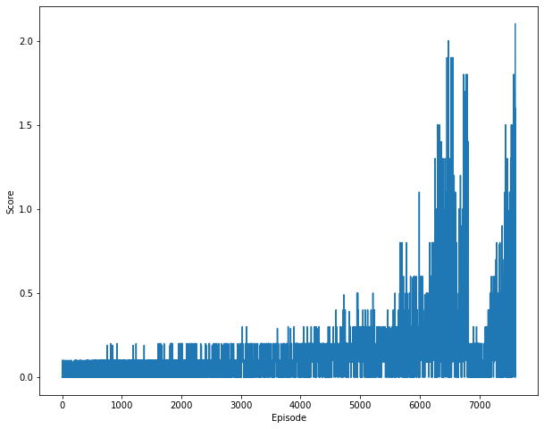

# Report

This is a brief summary about the implementation chosen to solve the problem.

### Learning Algorithm

Proximal Policy Optimization (PPO) algorithm ([paper](https://arxiv.org/abs/1707.06347)) was used to solve the problem.
Generalized Advantage Estimation was used to calculate estimated returns. ([paper](https://arxiv.org/abs/1506.02438))

The network architecture consists of branched Actor and Critic models, that share the same base built out of 3 linear layers 
each followed by relu activation function. The critic learns what is the estimated reward for each step, while actor learn
what step to take given the environment state. 
Single model was trained to learn the behaviour of multiple agents from shared, collected trajectories.

Hyperparameters used in the algorithm are as follows:

- ```batch_size = 64``` - Size of each minibatch that are used for training the network to learn.
- ```lr = 1e-4``` - Learning rate at which the model learns.
- ```gamma = 0.99``` - Discount factor which specifies how important (or not) are the past rewards
- ```gae_tau = 0.95``` - Used to weight each of the n-bootstrapped estimated returns. Part of GAE.
- ```beta = 0.001``` - Control how much noise (entropy) to add to the actor's loss, which encourages exploration.
- ```epsilon_clip = 0.2``` - Clips the ratio between the ratio of logprobs from new policy and old policy, so that the network doesn't change the old polict too much
- ```gradient_clip = 10``` - Clips the calculated gradient at each step.
- ```update_every = 20``` - Update the ActorCritic model after every x episodes.

### Plot of Rewards

The following plots shows rewards collected by the agent over time (episodes). The environment was solved in 7604 episodes.



```python
Episode 0/10000 | Average Score: 0.0
Episode 500/10000 | Average Score: 0.03
Episode 1000/10000 | Average Score: 0.03
Episode 1500/10000 | Average Score: 0.04
Episode 2000/10000 | Average Score: 0.06
Episode 2500/10000 | Average Score: 0.08
Episode 3000/10000 | Average Score: 0.09
Episode 3500/10000 | Average Score: 0.1
Episode 4000/10000 | Average Score: 0.1
Episode 4500/10000 | Average Score: 0.1
Episode 5000/10000 | Average Score: 0.13
Episode 5500/10000 | Average Score: 0.13
Episode 6000/10000 | Average Score: 0.2
Episode 6500/10000 | Average Score: 0.39
Episode 7000/10000 | Average Score: 0.1
Episode 7500/10000 | Average Score: 0.31
Episode 7600/10000 | Average Score: 0.47
Environment solved in 7604!
```

It was interesting to see how the average score dropped significantly after 6500 episodes and then climbed again at around 7000+.

### Ideas for Future Work

Try any of the following algorithms:

- A2C (Advantage Actor Critic)
- A3C (Asynchronous Advantage Actor-Critic)
- DDPG (Deep Deterministic Policy Gradients)
- D4PG (Distributed Distributional Deterministic Policy Gradients)

Or following changes:

- Use different hyperparameters
- Play more with an idea of each agent having its own independent ActorCritic model. 
I've actually tested this but the performance wasn't very good. Perhaps more experiementation should be encouraged.
